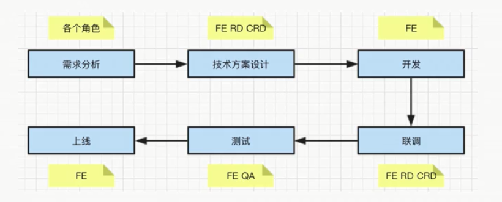

## 客户端
### 从输入URL到浏览器显示页面过程中都发生了什么
1. Url解析
2. DNS查询
3. TCP连接
4. 服务器处理数据
5. 浏览器接收数据
6. 渲染页面
7. js解析执行   


### 详细流程

1. Url解析
- 查看url是否是合法的url,是否带关键字
- HSTS检查,具备条件会把http转换成https
- 安全检查,网页限制(国内浏览器当时限制996.icu)
- 浏览器缓存的检测,强缓存(exipres/cache-control)与协商缓存(if-Modified-Since/if-None-Match)
2. DNS查询
- 浏览器缓存
- 操作系统的缓存(先在本地查询host文件,在使用内网时会配置host文件)
- 路由器缓存
- ISP/DNS缓存(有次开发我们使用dns,改了点小问题后,没有清理dns缓存,所以没有更新上)
- 根据域名查询
3. TCP连接
**发送端**
- 应用层:发送http请求
- 传输层:TCP传输报文
- 网络层:IP协议查询Mac地址
- 数据链路层:以太网协议
**接受端**
接受端逆向发送的过程
注意:发送端每通过一层增加首部,接受端每通过一层删除首部
4. 服务器处理请求
- 接受TCP报文后,对连接进行处理,对HTTP协议进行解析
- 重定向
- Url重写
5. 浏览器接受响应
- 根据不同状态码与响应资源做不同事情(如:重定向或开启gzip压缩,需要解压等)
6. 渲染页面
- html解析**浏览器解析是从上到下一行一行地解析**
    - 解码:把二进制转成字符串,也就是html形式
    - 预解析:提前加载资源,如图片src属性,把请求放入队列中
    - 符号化:词法分析过程,解析成html符号,开始标签,结束标签,属性值,属性名等,识别符号
    - 构建树:符号化和构建树是并行操作的，也就是说只要解析到一个开始标签，就会创建一个 DOM 节点,构建html tree.
    - 容错机制:你从来没有在浏览器看过类似”语法无效”的错误，这是因为浏览器去纠正错误的语法，然后继续工作。
    - 事件:浏览器会通过DOMContentLoaded事件来通知DOM解析完成
- css解析
    - css匹配规则:从右到左的顺序,注:尽量用id与class,不要过度层叠.
- 渲染树
    - 计算:让任何尺寸转化成三者(auto/百分比/px)之一,如:rem转化成px.
    - 级联:计算权重
    - 渲染阻塞:css会阻塞js执行,js会阻塞后面的dom解析(css放在js前面,js放在/body前)
- 布局与绘制
    确定渲染树的所有节点属性(位置大小),调用渲染器paint()方法在屏幕显示内容
- 合并渲染层
    把以上绘制合并到一起展示
- 回流与重绘
    - 回流:当几何属性发生变化时,改变位置,需要从html标签开始递归向下,重新计算位置大小.
    - 重绘:除了几何属性(颜色等),需要合并渲染层,重新渲染到屏幕上.
7. Javascript编译执行
- 词法分析:js加载完成后,先进入词法分析,分析代码块语法是否正确,抛出错误停止执行.
    - 分词:例如将var a=8,分成var, a, = , 2这样的词法单位
    - 解析:将词法单元转换成机器指令
    - 代码生成:将语法树转换成机器指令 
- 预编译:每进入一个不同的运行环境都会创建一个对应的执行上下文，根据不同的上下文环境，形成一个函数调用栈，栈底永远是全局执行上下文，栈顶则永远是当前执行上下文。
    - 创建执行上下文
        - 创建变量对象:参数,函数,变量
        - 建立作用域链:确认当前执行环境是否能访问变量
        - 确定this指向
    - js执行:js单线程,同步异步与evenloop

### 性能优化-浏览器缓存

<div id="huancun">浏览器缓存（Brower Caching）是浏览器在**本地磁盘**对用户最近请求过的文档进行存储，当访问者再次访问同一页面时，浏览器就可以直接从本地磁盘加载文档。</div>
好处有：**减少冗余数据传输、减少服务器负担、加快客户端加载网页的速度**。
- html 不能缓存
- js/css/img等可以缓存(在webpack打包的时候,通常通过hash值输出不同的文件名,如果内容不变,输出的hash不变,从而起到缓存)

浏览器的缓存规则分为两大块：强制缓存和协商缓存。（由 HTTP Response Headers 设置)  
强制缓存：客户端首先在本地检测是否有要请求的数据，如果有直接在本地获取，如果没有向服务端获取。  
协商缓存：客户端在本地获取请求标识，带着这个标识去服务端请求内容，如果请求缓存没有过期，返回 304，在本地获取请求数据，如果过期就在服务端获取请求数据。

强制缓存的实现  

在服务端设置
```
   Cache-Control:max-age=300(以秒为单位)
   max-age:缓存时间,no-cache不使用强缓存
```
expires被Cache-Control代替


协商缓存的实现  
Last-Modified:HTTP response headers 中返回 Last-modified 返回头标识了此资源最后在服务端请求的时间,与if-modified-since。(只能精准到秒级)
Etag：服务端针对这个资源通过算法返回一个唯一的值,与if-none-match。(会优先使用etag,更精准)


##### 浏览器缓存全过程

1. 浏览器第一次加载资源，返回 200，重服务端获取资源，把资源保存到本地以及 response header.
2. 第二次加载资源，先走强缓存，cache-control 的 max-age 有没有超时，如果没有超时，直接走强制缓存。
3. 没走强缓存，则进行协商缓存，根据 etag 与last-modified值，判断是否和上次请求一样，如果一样返回 304(告诉你没有变化,在本地拿资源就可以)，如果不一样返回 200，重新加载资源。

##### 缓存保存到哪里？

Service Worker  
Service Worker 运行在 JavaScript 主线程之外，虽然由于脱离了浏览器窗体无法直接访问 DOM，但是它可以完成离线缓存、消息推送、网络代理等功能。  
Memory Cache  
Memory Cache 就是内存缓存，它的效率最快，但是存活时间最短，你一关掉浏览器 Memory Cache 里的文件就被清空了。  
Disk Cache  
Cache 资源被存储在硬盘上，存活时间比 Memory Cache 要持久很多。

##### 不同刷新,不同缓存
- 正常操作:强缓存有效,协商缓存有效
- 手动刷新:强制缓存失效,协商缓存有效
- 强制刷新:强制缓存失效,协商缓存失效


##### 说说你所知道的性能优化的方法？
空间换时间,请求快,加载快,渲染快  

通用web优化:   
1. 使用 cdn，通过 dns 负载均衡技术请求最近的 chache 服务器，以最快的速度请求服务器内容，也可以放一些静态资源放在 cdn 服务器上。
2. 合理利用[浏览器缓存](#huancun)。
3. 使用雪碧图，合并 js 方法，减少请求数量。
4. 合并 css，js，减少请求的体积，服务端可以使用 Gzip 压缩。
5. 使用外联 css 与 js，css 放在头部（浏览器会等 css 加载后在渲染，避免重排，放在尾部会出现白屏），js 放在尾部，减少页面阻塞并发请求，使用代码拆分及延迟加载
6. 图片颜色复杂体积大优先使用 jpg，图片小不复杂例如图标优先使用 PNG8，图片颜色复杂半透明效果使用 PNG24.
7. 减少回流与重排，重绘。
    - dom查询的结果放在变量中
    -  频繁操作 demo 时使用 fragment
8. 防抖与节流
9. SSR:服务器端渲染:将网页和数据一起加载,一起渲染.(非SSR:先加载网页,再加载数据,在渲染数据)   

vue优化:     
1. v-if与v-show的合理使用
2. v-for与v-if不能同时使用
3. v-for加key
3. watch与computed合理使用
4. 不改变的长列表,通过object.freeze()冻结数据
5. 图片懒加载
6. 路由懒加载
7. 事件的销毁,beforDestroy的生命周期中,移除addEventListener等自定义事件
8. 按需引用
9. 无限列表性能,使用vue-virtual-scroll-list
10. 使用异步组件（v-if+（）=》important ）
11. 使用keep-alive 缓存组件
12. data层级不要太深

webpack优化:   
1. 图片进行压缩:image-webpack-loader
2. 减少ES6转为ES5的冗余代码:babel-plugin-transform-runtime
3. CommonsChunkPlugin提取公共代码
4. 模板预编译,可以使用vue-template-loader将模板文件转换成js渲染函数
5. 提取组件css,webpack+vue-loader(vue-cli的webpack模板已经预选配置好)
6. 使用webpack-bundle-analyzer对构建结果输出分析

##### 防抖与节流

节流函数

使用场景:页面大小改变
```
const throttle = (fn, delay=3000) => {
  let pre = 0;
  return (...args) => {
    let now = new Date().getTime();
    if (now - pre > delay) {
      fn.apply(this, args);
      pre = now;
    }
  };
}
let throttlefn = throttle(function(){console.log('执行的内容')},2000)
```

防抖函数

使用场景输入框change事件
```
const debounce = (func, time) => {
  let timer = null;
  return (...args) => {
    let This = this;
    clearTimeout(timer);
    timer = setTimeout(() => {
      func.call(This, args);
      timer = null;
    })
  }
}
```

#### 对重构的理解
**在不改变UI及外部行为的情况下,简化结构增加可读性,提高网页性能.** 


#### 什么是 XSS 攻击？如何防止 XSS 攻击？

XSS 是跨站脚本攻击，是 web 应用计算机安全漏洞，通过代码嵌入页面当中。

防止攻击的方法：
1. 在输入时进行转码，如 html 中<>标签等特殊符号,不让执行script代码,可以是用npm 的 xss 进行防御
2. Cookie 设置 httponly，防止用户通过 document.cookie 获取到 cookie，⚠️ 此 http 头由服务端设置。
3. 重 url 获取值的时候一定要进行格式检查。
4. 不是用 eval 解析运行不确定的数据，json 解析请使用 JSON.parse。
5. 服务端也应该做的关键字的过滤。

XSS 的攻击过程是这样的：通过在受害者打开的目标网页上执行恶意脚本来窃取用户的 cookie 值，黑客使用 cookie 值在自己的电脑上冒充用户来进行隐私操作。

####  什么是 CSRF 攻击？如何防止 CSRF 攻击？ 

CSRF 跨站请求伪造 伪造用户信息  其攻击方式为在受害者不知情的情况下使受害者发送请求至目标服务器  
CSRF 攻击的核心在于利用用户请求时携带的 cookie 令牌信息来冒充用户

防止攻击的方法：
1. HTTP头中有一个字段叫作Referer，它记录了HTTP请求来源的地址
2. 添加 token 验证,等验证,短信验证码,指纹等
3. 使用post接口

而 CSRF 的攻击过程是这样的：黑客不窃取用户的任何信息，黑客通过诱使受害者点击恶意链接来向目标网站发送请求。


#### cookie session localStrage seesionStrage

生命周期  
cookie 一般是服务器端生成，保存在客户端,可设失效时间，如果在客户端设置，默认生命周期是浏览器关闭。 
session  保存在服务端，长时间不活动会失效。
localStrage 没有失效时间，除非手动清理。  
seesionStrage 在页签及窗口关闭后失效  
大小  
cookie 4k strage 5M  
与服务器  
cookie 每次携带http请求头，不能使用过多的内容，会影响性能,只能用document.cookie = '...',来修改,太过简陋 
strage 不与服务器交互，api简易setItem,getItem,key-value的形式
作用  
cookie 尽量精简，只携带与服务端交互所需要的信息，例如 token 验证登录信息  
strage 保存浏览器需要的本地数据，例如购物车信息等。
session需要cookie作为标识， 服务端向客户端发送一个jsession的cookie，值为该session的ID，session依据cookie来识别是否是同一个账户。

### 跨域
- 在vue项目中，通过devserver中proxy的target设置代理跨域目标接口，实现跨域。
- 在线上环境会通过nginx反向代理的方法实现跨域。
    - 反向代理技术引入一个负载均衡器，并在负载均衡器后面设置多个服务器，所有的服务器会保证提供相同的内容，以便用户无论哪个服务器响应，都能收到。
- 在微信小程序通过右上角详情的设置，把不校验域名的配置勾选上
- 在jq项目中使用jsonp实现跨域，利用script标签+callback
    - 本质不是 ajax 请求，而是通过 script 标签，ajax 有同源策略的限制，script 标签不会限制 🚫
- domain+ifram（原理就是多个页面，domain设置一样）
- CORS
    - 首先浏览器判断请求是简单请求还是复杂请求
    - 如果是复杂请求，那么在进行真正的请求之前，浏览器会先使用 OPTIONS 方法发送一个预检请求 (preflight request)，OPTIONS 是 HTTP/1.1 协议中定义的方法，用以从服务器获取更多信息。该方法不会对服务器资源产生影响
    - 预检请求中同时携带了下面两个首部字段：
        - Access-Control-Request-Method: 这个字段表明了请求的方法；
        - Access-Control-Request-Headers: 这个字段表明了这个请求的 Headers；
        - Origin: 这个字段表明了请求发出的域。

    - 服务端收到请求后，会以 Access-Control-* response headers 的形式对客户端进行回复：
        - Access-Control-Allow-Origin: 能够被允许发出这个请求的域名，也可以使用 * 来表明允许所有域名；
        - Access-Control-Allow-Methods: 用逗号分隔的被允许的请求方法的列表；
        - Access-Control-Allow-Headers: 用逗号分隔的被允许的请求头部字段的列表；
        - Access-Control-Max-Age: 这个 preflight 能被缓存的最长时间，在缓存时间内，同一个请求不会再次发出 preflight 请求。
    
    - **如果携带cookie，客户端在 XMLHttpRequest 中，在发送跨域请求前必须要设置 withCredentials 字段为 true；**
        - axios设置：axios.defaults.withCredentials = true
        - vue-resource设置：Vue.http.options.credentials = true
    - **对于客户端携带身份信息的跨域请求，服务器不得设置 Access-Control-Allow-Origin 的值为 *。**
    - 根据请求头中的 Origin 来设置响应头 Access-Control-Allow-Origin(用于多个域名使用cors跨域)
- websocket：它实现了浏览器与服务器全双工通信，同时允许跨域通讯，
- node中间件代理，与nginx反向代理原理相同


#### JSONP

```
function msg(content){
   console.log(content)
}
function jsonp(req){
    var script = document.createEletment('script');
    var url = `${req.url}?callback=${req.callbackname}`;
    script.src = url;
    document.getElementsByTagName('head')[0].appendChild(script);
}
jsonp({url:'http://demojsonp.com/test',callbackname:msg})
```

过程描述：
客户端发送 script 请求，参数中带着返回数据回调函数的名字。  
服务端收到请求，返回（回调函数名字+参数）的立即执行函数（如上例子：msg（‘I am server information’））


## 项目流程

#### 项目所有角色
- PM产品经理
- UE视觉设计师/UI界面设计
- FE前端开发
- RD后端开发
- CRD移动端开发
- QA测试人员
  
#### 项目的全流程


- 需求分析
  - 了解背景
  - 质疑需求是否合理
  - 需求是否闭环,考虑是否全面
  - 开发难度如何,是否可行性/兼容性.
  - 是否需要其他支持
  - 不要急于给排期(要么今天晚上给你,不要自己给排期,看部门安排,或和老员工商量)
- 技术方案设计
  -  求简,不过度设计(减少开发人力,例如路由,没有要求不用history模式)
  -  产出文档
  -  找准设计重点
  -  组内评审
  -  和RD与CRD沟通
  -  发出会议结论
- 开发(你将如何保证项目质量?)
  -  排期(预留一点buffer,大约1/4的时间,考虑并行工作,及其他对接人员排期)
  -  符合开发规范(git/注释/命名)
  -  写出开发文档(写出如何调用)
  -  及时单元测试
  -  Mock Api
  -  Code Review
- 联调
  - 和RD与CRD技术联调
  - 让UE确定视觉效果(尽早 review)
  - 让PM确定产品功能(尽早 review)
- 测试
  - 提测发邮件,抄送项目组
  - 测试问题要详细记录
  - 有问题及时沟通
  - 不要说:"我电脑没有问题呀"
    - 当面讨论,让QA复现,提供设备
    - 有问题解决问题就好
- 上线
  - 上线后及时通知QA回归测试,同步PM与项目组
  - 如有问题,及时回滚,及时止损.
#### 各个阶段常见问题
- PM想在项目开发过程中增加需求,该怎么办?
  - 不能拒绝,走需求变更流程即可(我是MP我也会变更需求)
  - 有规定,按规定走,没有,发起项目和loader评审,重新评估排期
  - 改的少发邮件,或在tapd上记录一下
-  项目即将延期怎么办?
  - 及时沟通,及时汇报
  - 每日一沟通,有事说事,无事报平安
  - 及时识别风险,及时汇报


